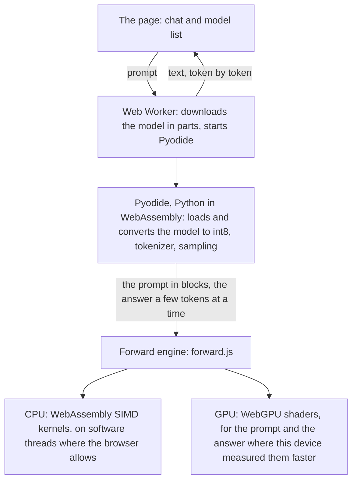

# Pyodide LLM

Language models that run in your browser, with the model code written in Python and run by
[Pyodide](https://pyodide.org/) (Python compiled to WebAssembly). Nothing is sent to a server: the page downloads
the model and runs it on your device. This is an experiment in how far Python on WebAssembly can go, not a product.
(Until September 2026 the project was called pyodide-llama-py.)



Python does the work around the model; the arithmetic of each token runs in small WebAssembly SIMD kernels, and in
WebGPU where the device has it and it is faster there. See [How it works](docs/architecture.md).

## Try it

Open **https://takano32.github.io/pyodide-llm/** and write a prompt.

- The default model is [tiny-lm](https://huggingface.co/sbintuitions/tiny-lm) (29M parameters, a 33 MB download,
  Japanese and English). It is the lightest model that writes Japanese, so that a phone does not fetch hundreds of
  megabytes before you ask for it. Its text is not good; it is fast (about 280 tokens/s in Chromium on the
  development machine).
- [llm-jp-3-150m](https://huggingface.co/llm-jp/llm-jp-3-150m) (171 MB) writes much better Japanese and English
  and is one click away. The page remembers the model you chose.
- The first visit reloads the page once. A Service Worker adds the headers that let the page use threads, and it
  keeps Pyodide and NumPy so that the page opens offline next time (`?offline=off` turns that off).
- Every answer shows the temperature, the seed and the speed. The button left of the prompt changes them; the seed
  under an answer is a button that fixes it, so two models can be compared on the same seed. The status line says
  what ran: the kernels, int8, relaxed SIMD, how many threads, and whether the prompt and the answer ran on WebGPU.
- While a text is being written, the send button stops it. Ctrl / Cmd + Enter sends; Enter alone breaks the line.
- [/benchmark/](https://takano32.github.io/pyodide-llm/benchmark/) measures your device (the browser's features,
  CPU, a model, GPU, storage, line, and on its own button how much memory a page can hold) and can open the result
  as a GitHub issue.

## Browsers

The weekly CI runs the deployed site on Linux, Windows (x86-64 and ARM) and macOS, in Playwright's Chromium,
Firefox and WebKit and in the installed Chrome and Edge: all 23 combinations run. What each browser adds:

| | Chrome, Edge | Firefox | Safari (WebKit) |
|---|---|---|---|
| WebAssembly SIMD kernels | yes | yes | yes |
| relaxed SIMD (int8 about 30% faster) | yes | yes | no |
| software threads (through the Service Worker) | yes | yes | yes |
| 64-bit memory: models over 4 GB | yes | yes | no |
| WebGPU for the prompt | yes | not in the Firefox of the CI (no WebGPU in a worker) | on the owner's iPhone; not in the CI's WebKit |
| WebGPU for the answer | yes, for Llama, Qwen2, Qwen3, GPT-2 and GPT-NeoX models | no | no (Safari does not say how much memory the device has) |

- Where a model does not fit in 32-bit memory and the browser has no 64-bit memory (Safari), the page stores the
  weights in 6 bits instead of 8. The 7B to 9B models do not fit even then, so they need Chrome or Firefox.
- The GPU is used by default where the browser has WebGPU. The page measures the GPU against the CPU on your device
  and keeps the CPU where it is faster. A model whose weights would not fit twice in memory (once for the CPU, once
  for the GPU; up to 2B on a device with 8 GB or more) goes on the GPU alone where it can (int8; Llama, Qwen2 and Qwen3). The
  page then estimates the CPU from the device's run of `/benchmark/`, loads the model again on the CPU if that is
  faster, and remembers it for the next visit. Other models too large to hold twice stay on the CPU.
- A browser that does not say how much memory the device has (Safari, Firefox) keeps the answer on the CPU, and
  `/benchmark/` skips its round without the kernels there (NumPy widens the weights to float32: for llm-jp-3-150m,
  Pyodide grew to 958 MB in CI's Chromium).
- For Safari, the only records are CI's WebKit (Playwright's build of Safari's engine) and the owner's iPhone.
  Safari on a Mac has not been tried.

Details and numbers: [docs/performance.md](docs/performance.md) and [docs/webgpu.md](docs/webgpu.md).

## Models

The model list has three groups:

- **Models of this site**: tiny-lm, llm-jp-3-150m and the TinyStories models from the
  [TinyLlamas](https://huggingface.co/karpathy/tinyllamas) project (260K to 42M parameters), in int8 (the small
  ones in float32). They are built into the site when it is deployed.
- **Unquantized originals** of some of them (float16 or float32), to compare with int8.
- **From Hugging Face, converted in this browser** (101 entries, from a 16 MB Pythia to 9B models: Llama, Mistral,
  Qwen2.5, Qwen3, Qwen3.5, Granite 4.2, MiniCPM5, llm-jp, sarashina, Swallow, GPT-2, GPT-NeoX and others). The page fetches the weights from
  huggingface.co (for 91 of them a GGUF: Q8_0, and for the three Ternary Bonsai their two-bit PQ2_0, read with the original
  repository's vocabulary and configuration),
  converts them to int8 in your browser (Ternary Bonsai stays in its 2 bits) with the same Python code that
  builds the site's models, and keeps the result for the next visit. About lists what is kept and deletes it. A
  download of more than 500 MB asks first.

`?model=<id>` opens a model of the list directly.

### A model that is not in the list

- `?hf=<owner>/<repository>` (optionally `&revision=` and `&template=` with `{prompt}` in it) converts a Hugging
  Face repository, and says in words what it cannot run. What it reads: the Llama architecture (with Llama 3,
  linear and yarn RoPE scaling, yarn only as a factor and an original context, nothing else it can set; Mistral is read
  as Llama), Qwen2, Qwen3, GPT-2 and GPT-NeoX, in safetensors (one file or
  several shards), with a Unigram or byte-level BPE `tokenizer.json` or a sentencepiece model. It does not open a
  repository that has only GGUF files: the GGUFs of the list are read together with the vocabulary and
  configuration of their original repository. Instruction models get what you type inside their chat template,
  for one turn; the page keeps no conversation.
- `?checkpoint=<url>&tokenizer=<url>` reads files in llama2.c's format from any server that answers cross-origin
  range requests, for example
  `?checkpoint=https://huggingface.co/karpathy/tinyllamas/resolve/main/stories110M.bin&tokenizer=https://raw.githubusercontent.com/karpathy/llama2.c/master/tokenizer.bin`.

### Your own model

The folder button next to the model list (or dropping the files on the page) opens a model from your disk. The
files are read where they are: nothing is uploaded. Choose the files together:

- **The files Hugging Face publishes**: one `.safetensors` file (not several shards), `config.json` and
  `tokenizer.json`, `tokenizer.model` or `spiece.model`. The page converts them to int8 in the browser, a few
  megabytes at a time, with no more memory than the converted model. `tokenizer_config.json` or
  `chat_template.jinja`, if you add them, give the chat template.
- **A checkpoint in llama2.c's format** (for example `stories110M.bin`, or what `convert_hf.py` and `quantize.py`
  write) and its `tokenizer.bin`. float32, float16 and int8 are told apart by the header and the file size.
- Optionally a `.json` with what differs from llama2.c's conventions, shaped like an entry of `src/models.js`:

```json
{ "name": "tiny-lm", "options": { "tokenizer_kind": "unigram", "stop_tokens": [1, 2] },
  "generation": { "steps": 256, "temperature": 0.7, "topp": 0.9, "repetition_penalty": 1.3 }, "prompt": "これからの流行りは" }
```

For the Hugging Face files, the `.json` may also say `{"conversion": {"dtype": "float16", "max_seq_len": 1024}}`.
A checkpoint of more than 1 GB asks first.

## How it works

1. The page resolves the latest Pyodide release when it loads (`?pyodide=<version>` forces one) and starts it in a
   Web Worker. The model is downloaded at the same time, in parts over several connections.
2. Python (`public/llama2_numpy.py`, `public/llama2_convert.py`) reads the model, converts a Hugging Face model to
   int8 as its file arrives, and handles the tokenizer and the sampling.
3. The forward pass of each token runs in JavaScript (`public/forward.js`), which calls WebAssembly SIMD kernels
   (`kernels/`, written in AssemblyScript) on the model's own WebAssembly memory. With threads, software threads
   (`public/helper.js`) share the rows of each matrix. The page measures how many threads are fastest on your
   device.
4. Where WebGPU is available, the blocks of a prompt and the tokens of the answer can run on the GPU
   (`public/gpu.js`, `public/shaders.js`). The page checks each shader against JavaScript on your device, times them,
   and uses the GPU only where it measured it faster than the CPU. The answer goes to the GPU 4 tokens at a time,
   each sampled there with the random number the CPU drew for it.

More:

- [docs/architecture.md](docs/architecture.md): the parts and how they talk to each other
- [docs/quantization.md](docs/quantization.md): int8, 6 bits, and what they cost in quality
- [docs/performance.md](docs/performance.md): speed, threads and memory, with the numbers
- [docs/webgpu.md](docs/webgpu.md): the GPU, what is done and what is measured
- An overview in Japanese, and the survey the project started from, are in this
  [gist](https://gist.github.com/takano32/196c6f93979ad44f98cee5712fdd3901).

## Development

Requirements: Node.js 24 LTS (`.nvmrc`; the page is built with [Astro](https://astro.build/)) and Python 3 with
NumPy.

```bash
git clone https://github.com/takano32/pyodide-llm.git
cd pyodide-llm
make run    # downloads and converts the models (about 1 GB), builds the kernels, starts http://localhost:8080/pyodide-llm/
```

Or with Docker: `docker build -t pyodide-llm . && docker run -p 8080:8080 pyodide-llm`.

- `make models` downloads, converts, quantizes and splits the models into `public/models/`. No binary is
  committed: the site's models are built when it is deployed.
- `make kernels` compiles the SIMD kernels (no Emscripten needed; see [kernels/README.md](kernels/README.md)).
- `npm run build` builds the site into `dist/`.

Checks:

- `python -m pytest tests -q`: the engine and the converter (native Python and NumPy).
- `node tests/smoke.mjs`: the engine and the models in Node's Pyodide (after `make models`).
- `node tests/forward-check.mjs`: the page's forward pass against NumPy.
- `npm run build && node tests/e2e.mjs [model] [chromium|firefox]`: the page in a real browser (Playwright).

Pushing to `main` deploys to GitHub Pages. [AGENTS.md](AGENTS.md) (in Japanese) holds the decisions, measurements
and pitfalls, and [TODO.md](TODO.md) the tasks.

## Acknowledgments

- [Pyodide](https://pyodide.org/) for the Python WebAssembly runtime.
- [llama2.py](https://github.com/tairov/llama2.py) by tairov for the pure Python Llama 2 implementation.
- [llama2.c](https://github.com/karpathy/llama2.c) for the inspiration and the model format.
- [tiny-lm](https://huggingface.co/sbintuitions/tiny-lm) by SB Intuitions (MIT License) for the default model; its
  license is deployed next to the converted file.
- [llm-jp-3-150m](https://huggingface.co/llm-jp/llm-jp-3-150m) by LLM-jp (Apache License 2.0).
- [TinyLlamas](https://huggingface.co/karpathy/tinyllamas) by Andrej Karpathy and
  [ellishg/tinyllamas](https://huggingface.co/ellishg/tinyllamas) for the TinyStories checkpoints.
- [llama.cpp](https://github.com/ggml-org/llama.cpp), [ONNX Runtime](https://github.com/microsoft/onnxruntime),
  [TensorFlow.js](https://github.com/tensorflow/tfjs) and [MLC LLM](https://github.com/mlc-ai/mlc-llm) for the
  shapes of the WebGPU shaders.

## License

[Mozilla Public License 2.0](LICENSE), the same as Pyodide's. Some files carry code from other projects under their own licenses, and keep those notices where the code is: `public/llama2_numpy.py` (tairov/llama2.py and karpathy/llama2.c, MIT) and `public/shaders.js` (llama.cpp and ONNX Runtime, MIT; TensorFlow.js, MLC LLM and Apache TVM, Apache-2.0). The models are not in this repository and each keeps its own license (see the model list).
