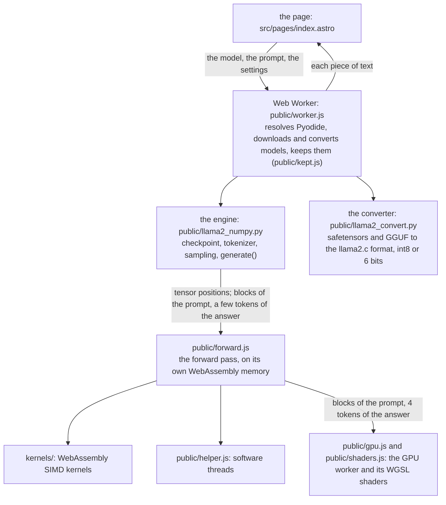

# How it works

This page describes the parts of the site and how they talk to each other. The decisions behind them, with dates
and measurements, are in [AGENTS.md](../AGENTS.md) (in Japanese).

## The parts

| Part | What it does |
|---|---|
| `src/pages/index.astro` | The chat page. It draws what the worker reports; the URL holds the state (`?model=`, `?hf=`, `?bits=`, `?without=` and others). |
| `src/models.js` | The model list: files, sizes, engine options, generation settings, chat templates. The first entry is the default. |
| `public/worker.js` | Loads Pyodide and NumPy, downloads the model in parts while Pyodide loads, and runs `generate()`. |
| `public/llama2_numpy.py` | The engine. Reads llama2.c's legacy format (float32, float16, int8, 6 bits), the tokenizers (llama2.c's BPE, sentencepiece Unigram, byte-level BPE), the architectures (Llama, Qwen2, Qwen3, GPT-2, GPT-NeoX), and samples. Without the kernels, NumPy does the arithmetic. |
| `public/llama2_convert.py` | Converts a Hugging Face model (or a Q8_0 GGUF) as its file arrives, and writes it into the model's memory. The same code builds the site's models (`convert_hf.py`, `quantize.py`) and converts in the browser. It also reads a model's chat template (a small part of Jinja). |
| `public/forward.js` | One token's forward pass, and a block of prompt tokens, in JavaScript. It calls the same kernels in the same order as the Python engine would, and chooses for each block and each few tokens whether the CPU or the GPU runs them. |
| `kernels/` | The SIMD kernels: int8 and float32 matrix products, activation quantization, RMSNorm, LayerNorm, RoPE, attention, SwiGLU, GELU, and the sampling (repetition penalty, softmax, top-p). |
| `public/helper.js`, `public/jobs.js` | Software threads, and the work they share. |
| `public/gpu.js`, `public/shaders.js` | The GPU worker and all WGSL shaders. |
| `public/coi.js` | The Service Worker: adds the headers for threads, keeps Pyodide and NumPy for offline use. |
| `public/benchmark/`, `src/pages/benchmark.astro` | `/benchmark/`, the measurements of one device in one report. |

## Why the forward pass is in JavaScript

Until September 2026, Python ran the layers in order and called the kernels through `ctypes`, working in place on
NumPy memory. Two things moved the loop out of Python:

- Each `ctypes` call cost about 3 µs, and calls between layers added up (6% of a token of llm-jp-3-150m). Moving the
  loop of layers to JavaScript made int8 models 1.15 to 1.26 times faster.
- Pyodide does not expose its own `WebAssembly.Memory`, so JavaScript could not run the kernels on Python's
  memory. The weights now live in a separate WebAssembly memory that `forward.js` owns, and Python only tells it
  where each tensor is. A converted model is written straight into that memory.

Python still does everything around the arithmetic: reading and converting models, the tokenizer, the chat
template, the sampling (through a kernel), and the text that goes back to the page. NumPy remains the fallback
when the kernels cannot be loaded (`?without=kernels`), and the reference that the tests compare with.

## Threads

A page on GitHub Pages cannot send the headers (COOP and COEP) that allow `SharedArrayBuffer`. The Service Worker
(`public/coi.js`) adds them to every response, so after one reload the page is cross-origin isolated and can share
memory between workers. Where that fails, the page runs on one thread.

With shared memory, the forward pass is split among software threads: each matrix product is cut into chunks of
rows that the threads take in turn, and attention is split by head. The page searches for the fastest number of
threads on each device and writes its decision to the console (lines starting with `threads:`).

## Memory

- WebAssembly has 32-bit addresses (4 GB). Where the browser has 64-bit memory (Chrome and Firefox), a model that
  does not fit runs on it, about 10% slower. Where it does not (Safari), the page stores the weights in 6 bits.
- What the forward pass needs besides the weights (the KV cache for the whole context, the activations) is
  computed from the header before the model is loaded (`footprint()` in `forward.js`). The cache starts at 256
  positions and doubles in place, moving each layer's block up into the room it adds, so that at most the whole
  context is held (before, the old blocks stayed next to the new ones while they were copied: 1.5 times the
  context at the last step). The same place decides the type of the KV cache: float32 on one thread; float16 with
  threads, except for a model with grouped-query attention, which keeps float32 unless that would push it out of
  32-bit memory or it needs 64-bit memory anyway (see [performance.md](performance.md#threads)). Where the page asks
  for a shared memory (for threads) and the browser refuses it, or the page is not cross-origin isolated, the model
  runs on one thread with float32, except where float16 keeps it within 32-bit memory and float32 would not: there
  float16 is kept so that the model still reaches the end of its context.
- The model's WebAssembly memory is reused when another model is chosen: Chromium would not create a third
  WebAssembly memory on one page. Before the next model loads, the page also waits (up to 5 seconds) for the GPU
  worker of the last one to let go of its buffers and its device.

## Downloading and converting

- The site's models are split into parts of 8 MiB and fetched over 8 connections while Pyodide loads.
- Hugging Face models are fetched in parts of 8 or 16 MiB over 6 connections, in the order of the file, and each
  tensor is converted when it arrives. The download is never held as a whole: the peak is about the converted
  model.
- 47 of the 53 Hugging Face models in the list are fetched as a Q8_0 GGUF, with the vocabulary and the
  configuration of the original repository: about half the download, the same weights to within the rounding of
  the scales. Each GGUF was compared with its original tensor by tensor before it replaced it, one file at a time:
  two GGUFs from the same publisher can differ (Qwen's own GGUFs of Qwen3 0.6B and 1.7B did not match their
  originals, so those two come from another publisher).
- Converted models are kept in the browser (OPFS, or the Cache API), so the next visit fetches nothing.

## The GPU

Where the browser has WebGPU in a worker, `forward.js` starts a GPU worker for each model. It copies the int8
weights of the layers to the GPU (and the classifier and the embeddings, where the answer can run there too),
checks each shader against JavaScript on this device, and times them. Then the blocks of a prompt (up to 64
tokens) and the tokens of the answer (4 in one submission, each sampled on the GPU with the random number the CPU
drew for it) run on the GPU where that was measured faster than the CPU. The keys and values one side computes are
copied to the other, so either can go on from any position. See [webgpu.md](webgpu.md).

## The tokenizers

The engine reads three kinds of tokenizer: llama2.c's BPE, sentencepiece's Unigram, and byte-level BPE (GPT-2's
kind, with the pre-tokenizers of GPT-2, SmolLM2, Qwen and Llama 3). They are compared with the real ones (Hugging
Face's `tokenizers` and `sentencepiece`) on every character (for sentencepiece, those of the Basic Multilingual
Plane) and on random texts. A sentencepiece model's normalizer is its own map, carried in the converted tokenizer,
and the added tokens of a `tokenizer.json` are read as one token wherever they are written, as the real ones do.
The few differences known today (the space before the first word that a few tokenizers leave out and the page
always writes, and special tokens typed in a prompt, which the page reads as text unless its chat format writes
them) are recorded in [AGENTS.md](../AGENTS.md). Their speed is in [performance.md](performance.md#the-tokenizer).
